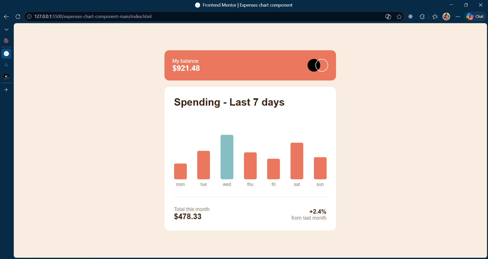

# Frontend Mentor - Expenses chart component solution

This is a solution to the [Expenses chart component challenge on Frontend Mentor](https://www.frontendmentor.io/challenges/expenses-chart-component-e7yJBUdjwt). Frontend Mentor challenges help you improve your coding skills by building realistic projects. 

## Table of contents

- [Overview](#overview)
  - [The challenge](#the-challenge)
  - [Screenshot](#screenshot)
  - [Links](#links)
- [My process](#my-process)
  - [Built with](#built-with)
  - [What I learned](#what-i-learned)
  - [Continued development](#continued-development)
  - [Useful resources](#useful-resources)
- [Author](#author)

## Overview

### The challenge

Users should be able to:

- View the bar chart and hover over the individual bars to see the correct amounts for each day
- See the current day’s bar highlighted in a different colour to the other bars
- View the optimal layout for the content depending on their device’s screen size
- See hover states for all interactive elements on the page
- **Bonus**: Use the JSON data file provided to dynamically size the bars on the chart

### Screenshot

](./preview.jpg)

### Links

- Solution URL: [To be added]
- Live Site URL: [To be added]

## My process

### Built with

- Semantic HTML5 markup
- CSS custom properties
- Flexbox
- Mobile-first workflow
- Vanilla JavaScript (DOM Manipulation & Fetch API)

### What I learned

This project provided great practice in dynamically generating DOM elements based on a local JSON file. Using the Fetch API, we can load the data and calculate the height of each bar relative to the maximum amount found in the dataset.

```js
const heightPercent = (item.amount / maxAmount) * 100;
const isToday = item.day === currentDayStr;
```

It also helped reinforce creating relative tooltips using CSS `position: absolute`:

```css
.amount-tooltip {
  position: absolute;
  bottom: calc(100% + 5px);
  left: 50%;
  transform: translateX(-50%);
}
```

### Continued development

In future projects, I want to continue refining responsive layouts without relying on media queries as much, instead leaning into CSS Flexbox intrinsic sizing. I also want to explore more complex data visualization.

### Useful resources

- [MDN Web Docs - Fetch API](https://developer.mozilla.org/en-US/docs/Web/API/Fetch_API/Using_Fetch) - A great reference for fetching data from JSON.
- [CSS Tricks - Flexbox](https://css-tricks.com/snippets/css/a-guide-to-flexbox/) - The ultimate guide to Flexbox layouts.

## Author

- Frontend Mentor - [@Umakanth](https://www.frontendmentor.io/profile/umakanthreddys140-sys)
